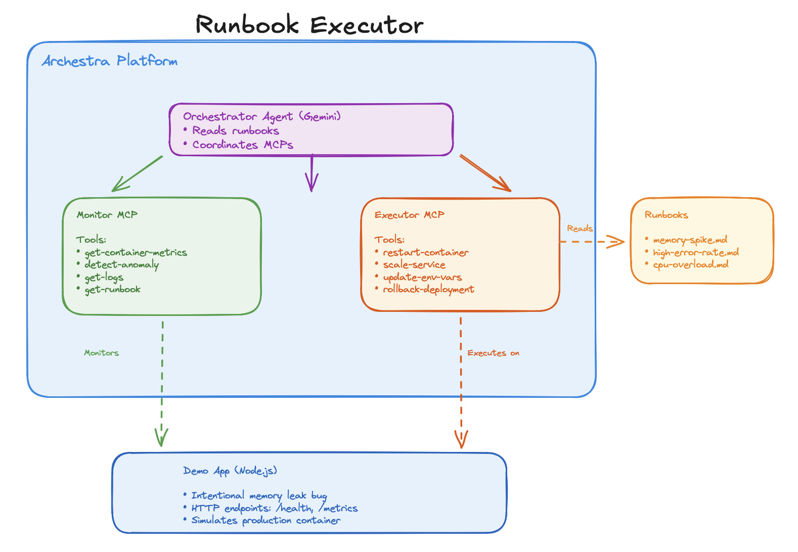

# Runbook Executor

Runbook Executor is a monorepo for AI-assisted incident remediation using:
- an MCP monitor server for detection and runbook lookup
- an MCP executor server for safe remediation actions
- a fault-injectable demo app
- a dashboard for live incident visibility

The project is built to simulate a self-healing workflow around Dockerized services.

## What It Does

At a high level, the system:
1. collects container metrics and logs
2. detects anomalies (`MEMORY_SPIKE`, `CPU_OVERLOAD`, `HIGH_ERROR_RATE`)
3. maps anomalies to markdown runbooks
4. executes guarded remediation actions through an executor MCP server

Supported automated actions include:
- `restart-container`
- `scale-service` (bounded by safety limits)
- `update-env-vars` (whitelisted keys only)
- `rollback-deployment` (currently scaffolded, not fully implemented)

## Architecture

Use this section for your architecture image:



Logical flow:

```text
Demo App (faults + metrics + logs)
      |
      v
Monitor MCP
  - get-container-metrics
  - get-container-logs
  - detect-anomaly
  - get-runbook
      |
      v
Orchestrator / Agent layer (e.g., Archestra)
      |
      v
Executor MCP
  - restart-container
  - scale-service
  - update-env-vars
  - rollback-deployment
      |
      v
Docker Engine
```

## Repository Layout

```text
.
├── packages
│   ├── demo-app        # Express app with fault injection and Prometheus metrics
│   ├── monitor-mcp     # MCP server for logs/metrics/anomaly/runbook tools
│   ├── executor-mcp    # MCP server for remediation tools + safety checks
│   ├── dashboard       # React dashboard (mixed live + mocked data)
│   └── shared-types    # Shared TypeScript contracts
├── runbooks            # Markdown runbooks used by monitor-mcp
├── scripts             # Setup/start/clean scripts
└── docker-compose.yml  # Archestra + demo app compose services
```

## How It Works

### 1) Fault Simulation

`packages/demo-app` exposes trigger endpoints to simulate incidents:
- `POST /trigger/memory-leak`
- `POST /trigger/error-spam`
- `POST /trigger/cpu-spike`

It also exposes:
- `GET /health`
- `GET /metrics` (Prometheus format)
- `GET /api/data` (can intentionally fail when error spam is active)

### 2) Detection and Runbook Selection

`packages/monitor-mcp` analyzes containers with Docker APIs and detects anomalies using thresholds:
- memory > 80%
- CPU > 90%
- error rate > 5% (based on recent log window)

When an anomaly is detected, it loads the matching runbook from `runbooks/`:
- `memory-spike.md`
- `cpu-overload.md`
- `high-error-rate.md`

### 3) Guarded Remediation

`packages/executor-mcp` validates each action before execution:
- replica limits: 1 to 5
- max actions/hour: 10
- max restarts/container/hour: 3
- min spacing between actions: 5 seconds
- env var updates restricted to a whitelist

This is intended to prevent runaway automation.

## Prerequisites

- Node.js >= 18
- pnpm >= 8
- Docker (daemon running, `/var/run/docker.sock` available)

## Getting Started

```bash
pnpm install
pnpm --filter shared-types build
pnpm dev
```

`pnpm dev` runs all workspace packages in parallel (watch mode).

## Docker / Archestra

To start compose services:

```bash
docker-compose up -d
```

Compose currently includes:
- `archestra` on ports `9000` and `3000`
- `demo-app` mapped as `3001:3000`

Note: if you run local `demo-app` dev server and compose `demo-app` together, port collisions may occur.

## Helpful Scripts

- `./scripts/setup.sh`: install + build packages
- `./scripts/start-all.sh`: start compose services then `pnpm dev`
- `./scripts/clean.sh`: remove build artifacts/dependencies and tear down compose volumes
- `pnpm build`: build all workspace packages
- `pnpm type-check`: run TypeScript checks across packages

## Current Dashboard Status

`packages/dashboard` is partially wired:
- log stream fetches from `http://localhost:8001/api/logs/...` (requires a backend endpoint not in this repo)
- agent activity and metrics charts are currently mocked in the frontend
- runbook viewer renders from hardcoded markdown for known anomaly types

The dashboard is useful for UI flow and demo storytelling, but not yet fully connected to monitor/executor runtime APIs.

## Runbooks

Runbooks are plain markdown under `runbooks/` and are parsed into structured steps by `monitor-mcp`.

Current runbook types:
- Memory spike
- High error rate
- CPU overload

## License

MIT
